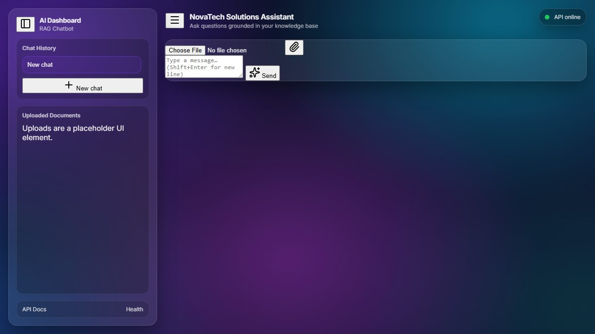

# NovaTech Solutions Assistant – Advanced RAG Chatbot

## Overview
NovaTech Solutions Assistant is a production-grade AI assistant built with a Retrieval‑Augmented Generation (RAG) architecture. It ingests your local documents, builds a FAISS vector index, retrieves the most relevant chunks for a question, and returns an answer in a modern glassmorphic dashboard UI.

## Key Features
- Real-time document indexing (TXT + PDF) into a local FAISS vector store
- Semantic search + top‑K retrieval with sources
- FastAPI backend with a clean REST interface
- Modern AI dashboard UI (glassmorphism, animated mesh gradient, chat history)
- Markdown rendering in AI responses (lists, bold, code blocks + syntax highlighting)

## Project Preview
Run `python capture_ui.py` to generate an up-to-date screenshot of the dashboard.



## Tech Stack
- FastAPI + Uvicorn
- LangChain
- FAISS (local vector store)
- OpenAI-compatible API (OpenRouter supported) + local fallback mode (no key required)
- HTML5 + CSS (glassmorphism dashboard UI)

## Setup Instructions

### 1) Create & Activate a Virtual Environment
```bash
python -m venv .venv
```

Windows PowerShell:
```bash
.\.venv\Scripts\Activate.ps1
```

### 2) Install Dependencies
```bash
pip install -r requirements.txt
```

### 3) Configure Environment Variables
Copy the template:
```bash
copy .env.example .env
```

Set one of the following modes in `.env`:

- OpenRouter mode (recommended for best responses):
  - `OPENROUTER_API_KEY=...`
  - `USE_LOCAL_EMBEDDINGS=0`
  - `USE_LOCAL_LLM=0`

- Local fallback mode (no API key):
  - `USE_LOCAL_EMBEDDINGS=1`
  - `USE_LOCAL_LLM=1`

### 4) Add Documents
Put `.txt` and `.pdf` files into `data/` (subfolders are supported).

### 5) Build the Vector Store
```bash
python ingest.py
```

### 6) Run the Server
```bash
uvicorn app.main:app --reload
```

### 7) Open the UI
- Dashboard UI: `http://127.0.0.1:8000/static/index.html`
- Swagger UI: `http://127.0.0.1:8000/docs`

## API Endpoints

### GET /
```bash
curl http://127.0.0.1:8000/
```

### GET /health
```bash
curl http://127.0.0.1:8000/health
```

### POST /chat
```bash
curl -X POST http://127.0.0.1:8000/chat ^
  -H "Content-Type: application/json" ^
  -d "{\"question\":\"What are NovaTech Solutions support hours?\"}"
```

### POST /ingest
```bash
curl -X POST http://127.0.0.1:8000/ingest
```
